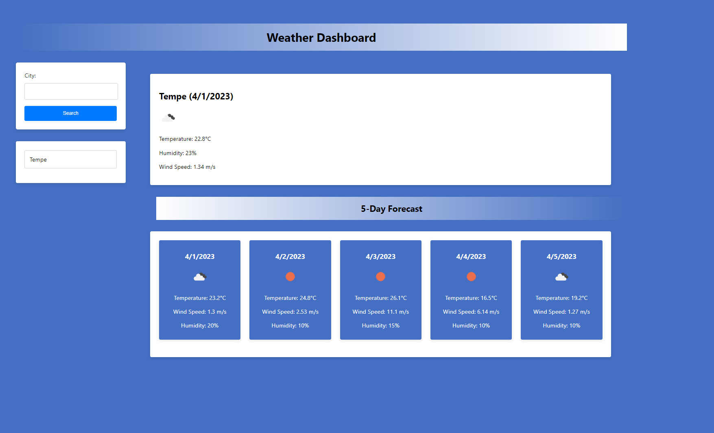

# Weather Dashboard

The Weather Dashboard is a web application that allows users to search for current weather and forecast information for a given city. It displays the current weather conditions as well as a 5-day forecast for the city. Users can search for a city using the search form, and the search history is maintained for easy access to previously searched cities.

## Features

- Search for current weather and forecast data for a given city.
- Display current weather information including temperature, humidity, and wind speed.
- Display a 5-day forecast with daily weather conditions.
- Maintain a search history for easy access to previously searched cities.

## Usage

1. Visit https://christopherflores9312.github.io/weather-dashboard/ in your web browser.
2. Enter the name of the city you want to search for in the "City" input field.
3. Click the "Search" button to fetch and display the weather data for the city.
4. The current weather information will be displayed in the right column, and the 5-day forecast will be displayed below it.
5. The search history in the left column allows you to quickly access previously searched cities by clicking on them.

## Project Structure

The project consists of the following files:

- `index.html`: The main HTML file that provides the structure of the web page.
- `assets/css/style.css`: The CSS file that contains the styles for the web page.
- `assets/js/script.js`: The JavaScript file that contains the logic for fetching and displaying weather data, as well as handling user interactions.

## API

The Weather Dashboard uses the OpenWeatherMap API to fetch current weather and forecast data. The API key is stored in the `script.js` file.

## Note

Please ensure that you have an active internet connection to use the Weather Dashboard, as it requires fetching data from the OpenWeatherMap API.

## Preview

